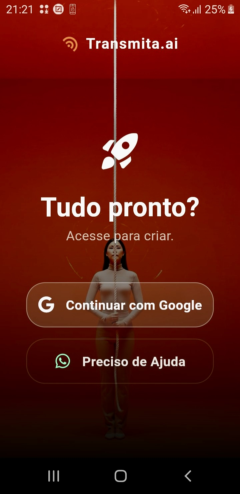
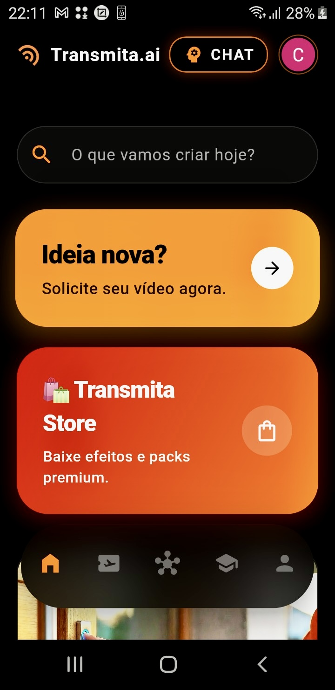
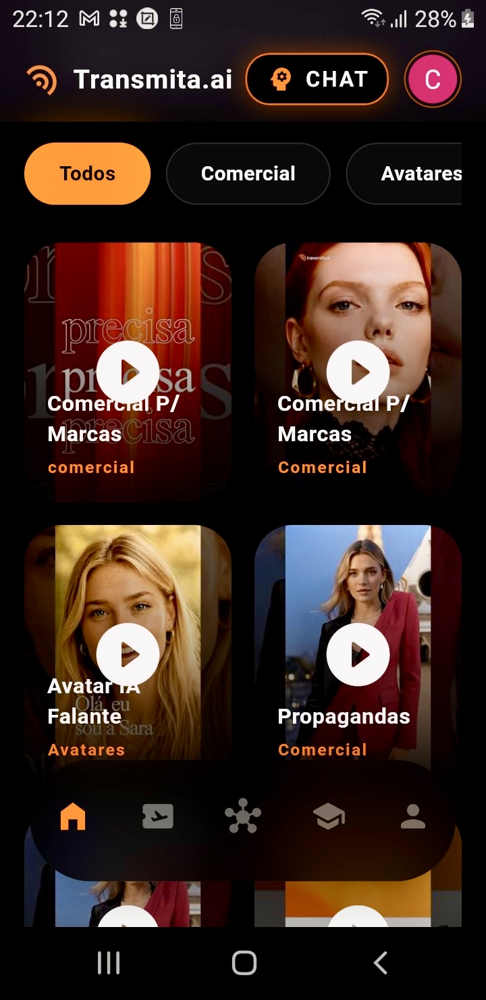
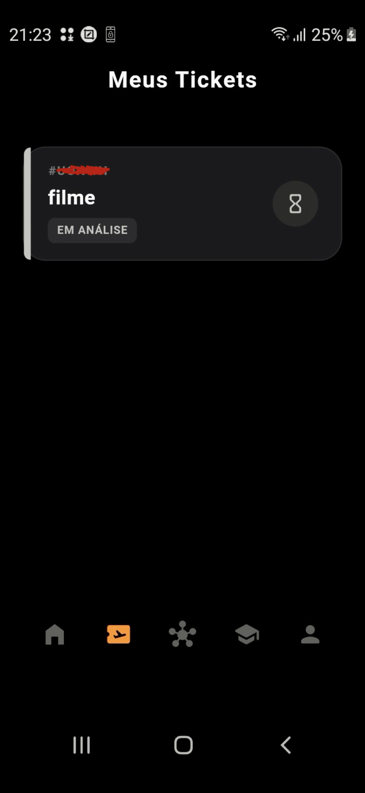
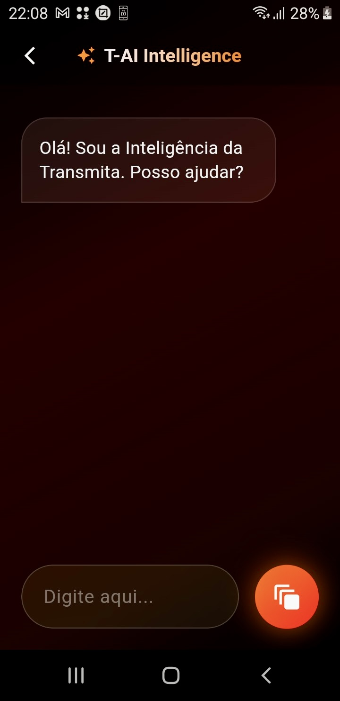
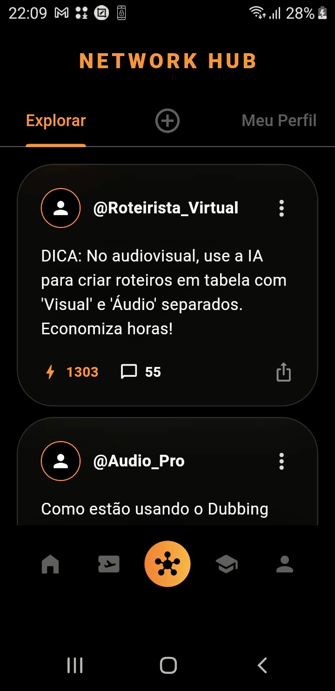
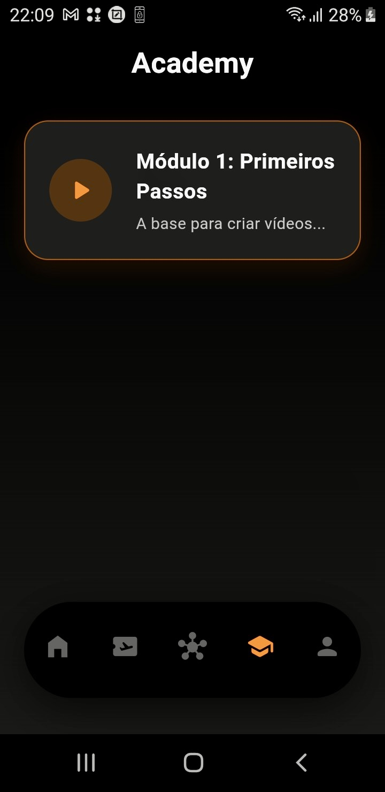
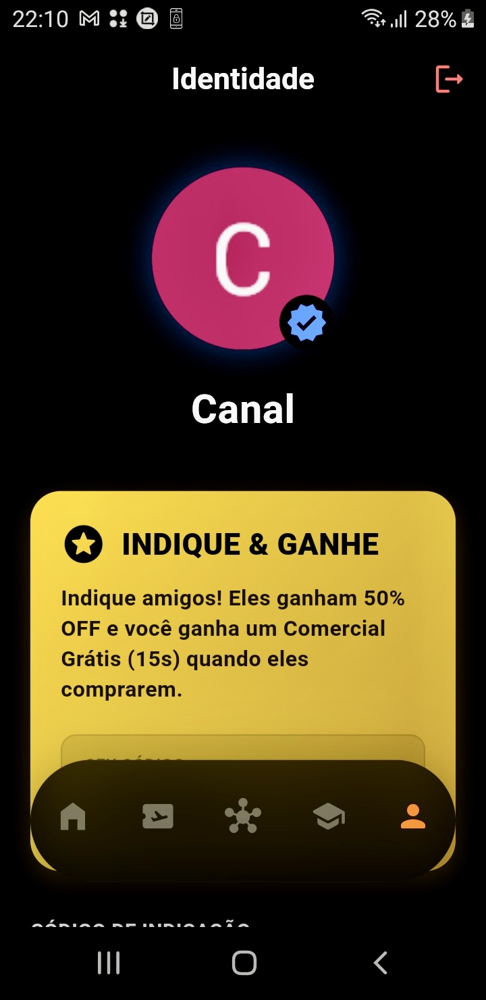

# 🎥 Transmita.ai

> **A Revolução da Produção Audiovisual no seu Bolso.**

O **Transmita.ai** é um **Ecossistema B2B Robusto** de alta tecnologia que democratiza o acesso a produções audiovisuais de nível cinematográfico. Muito mais que um app, somos uma plataforma funcional que une o poder do **Flutter**, **Inteligência Artificial** e **Agentes de Crescimento** para escalar marcas em segundos.

---

## 🚀 O Ecossistema Transmita (Funcionalidades)

### 🧠 Inteligência & Automação
* 🤖 **T-AI (Chat Inteligente):** Assistente virtual proprietário, capaz de gerar roteiros estratégicos e tirar dúvidas técnicas (Em Desenvolvimento Avançado).
* 📈 **Agentes de Crescimento:** Ferramentas automatizadas desenhadas para alavancar a presença digital da sua marca.
* ⚡ **Botão de Alavancagem:** Funcionalidade exclusiva "One-Tap" para impulsionar resultados e acelerar a produção.

### 📚 Educação & Serviços
* 🎓 **Transmita Academy:** Plataforma de ensino (LMS) integrada dentro do app, capacitando o usuário a dominar o audiovisual.
* 🎬 **Casting Digital:** Vitrine para contratação de atores reais diretamente pelo app.
* 🛍️ **Transmita Store:** Marketplace completo para aquisição de elementos visuais.

### 💎 Modelo de Negócio
* **Clube Transmita:** Sistema robusto de assinaturas (SaaS) com recorrência semanal, mensal e anual.
* **Dashboard Administrativo:** Nosso querido "Modo Deus" para gestão completa e métricas da plataforma (Acesso restrito).

---

## 🛠️ Tech Stack (Tecnologias de Alta Performance)

Construído sobre uma arquitetura escalável e segura:

* **Frontend:** Flutter (Dart) - *Performance Nativa*
* **AI Core:** Google Generative AI & Agentes Personalizados Internos
* **Conectividade:** Integração robusta via **APIs RESTful**
* **Backend:** (Serverless Architecture)
* **Media:** Video Player Otimizado & Integração Nativa
* **UI/UX:** Glass UI & Animações 3D Fluídas

---

## 🔒 Segurança e Configuração

Este é um projeto comercial de propriedade intelectual reservada. As chaves de API, credenciais de serviços externos e configurações sensíveis **não estão incluídas** neste repositório público por motivos de segurança e compliance.

---

## 📱 Galeria do App

| Login & Acesso | Home Principal | Vitrine & Feed | Gestão de Pedidos |
| :---: | :---: | :---: | :---: |
|  |  |  |  |
| **Acesso Seguro** | **Dashboard 3D** | **Vitrine Dinâmica** | **Status em Tempo Real** |

 

| Chat Inteligente (T-AI) | Network Hub | Transmita Academy | Perfil do Usuário |
| :---: | :---: | :---: | :---: |
|  |  |  |  |
| **IA Generativa (Gemini)** | **Comunidade B2B** | **Ensino Integrado** | **Gestão de Conta** |

---

### 👨‍💻 Liderança Técnica

**Desenvolvido por Lucas Prophetes** *Founder & CTO @ Transmita.ai* *Visionário em Inovação Audiovisual e Arquitetura de Software Mobile.*